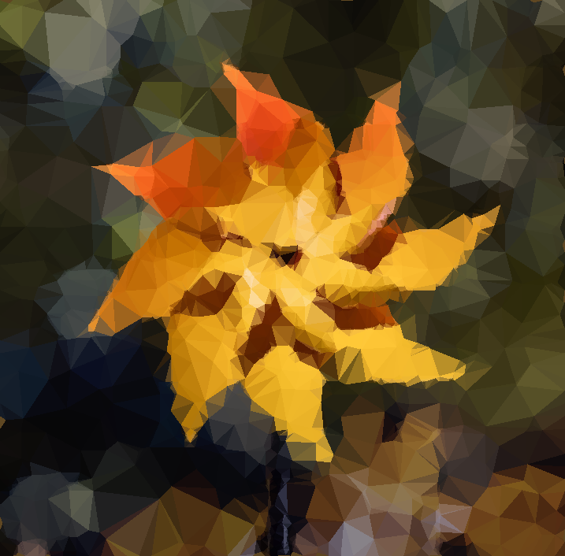
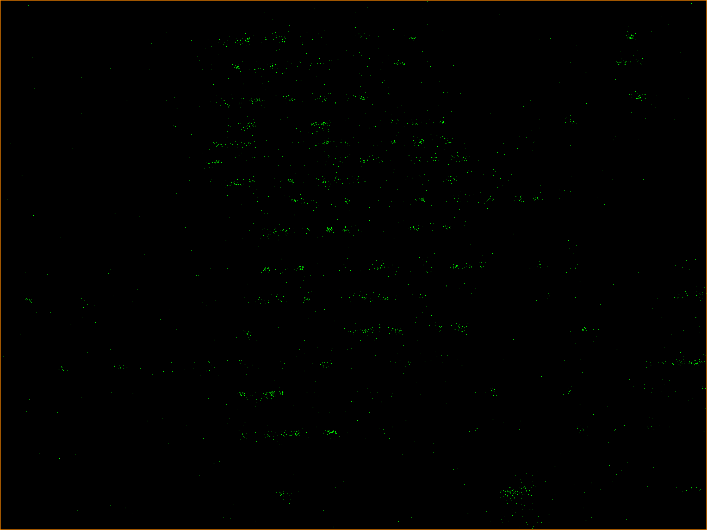
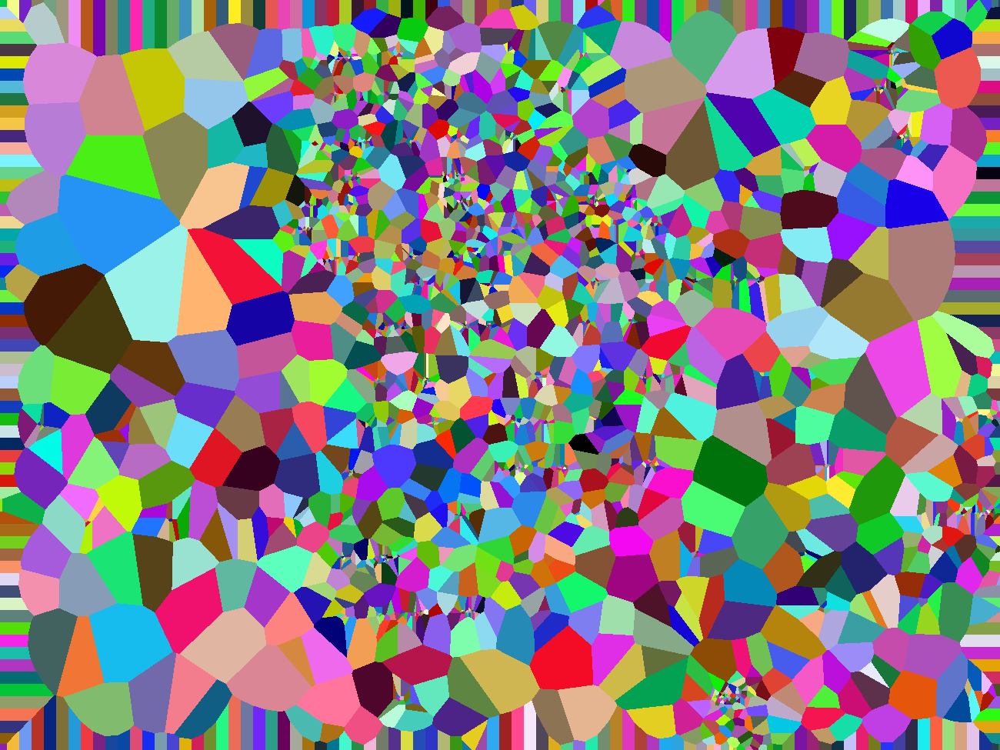
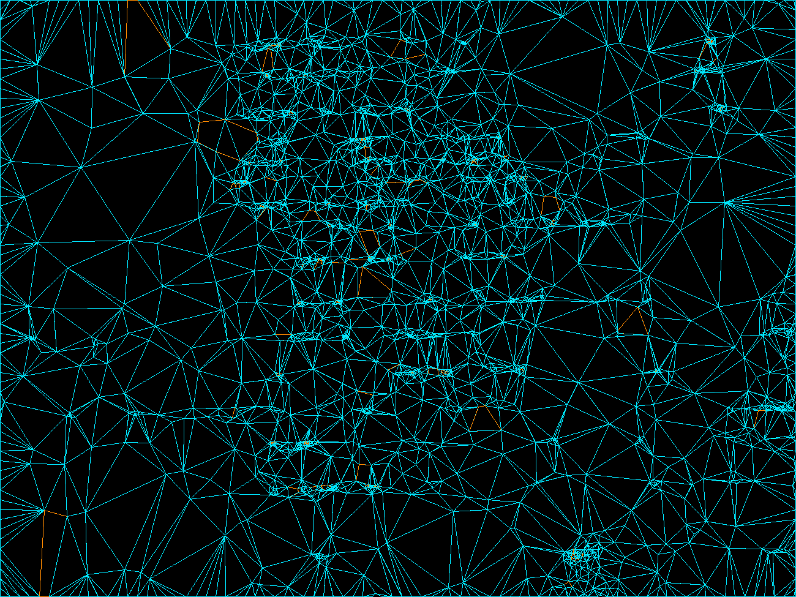
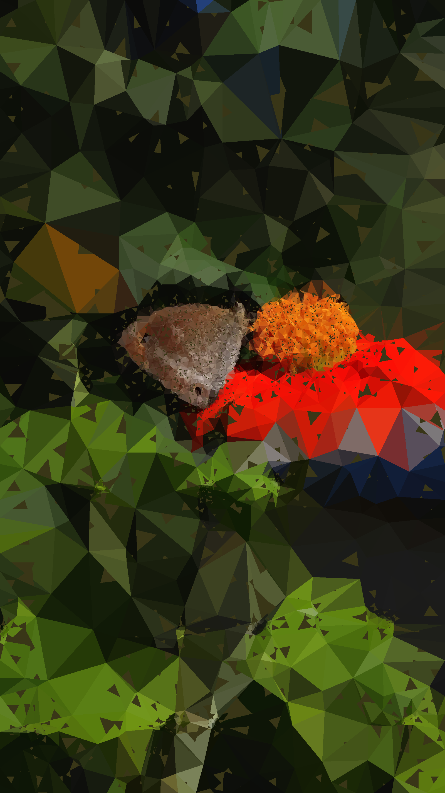

# lowpoly-cpp

Turns a photo into a low-poly abstraction keeping detail near edges.

| | |
|---|---|
|  |  |
|  |  |
|  |  |

This is a rewrite of an old class project (`fileMaker.cpp` and `driver.c`)
that took about 20 s on a 600x450 image. This version is four source files,
depends only on two vendored stb headers, and runs the same image in 6 ms.
It has a Metal backend on macOS and a CUDA backend on Linux.

```
lowpoly.h     types, stage signatures, the Gpu interface
lowpoly.cpp   cpu pipeline, cli, stage dumps, bench, tests
metal.mm      Metal kernels (compiled at startup) and ImageIO decode/encode
cuda.cu       the same kernels for CUDA
```

## 1. What it does

```sh
make                # macOS: cpu and Metal
make GPU=0          # cpu only, any platform
make CUDA=1         # Linux with nvcc
make test

./lowpoly photo.jpg                                  # photo-lowpoly.png and out/*.png
./lowpoly photo.jpg --points 2500 --uniform 0.02 --canny-low 20 --canny-high 60
./lowpoly photo.heic -o out.webp --backend gpu
```

Input is anything stb_image reads (png, jpg, bmp, gif, tga, psd, pnm). On
macOS it is also anything ImageIO reads (heic, webp, tiff, avif). The output
format follows the extension. The default is PNG. Every run also writes the
six intermediate images to `out/` and overwrites the previous run's.

The pipeline is shown below on `examples/monarch.jpg` (1300x975, 2500 points).

**`raw.png`** is the decoded input.


**`edges.png`** is the Canny edge mask: separable Gaussian, Sobel,
non-maximum suppression along the gradient, hysteresis. This is the only
place the image content steers the geometry.


**`points.png`** shows the seeds. The image is cut into grids at 150
resolutions. Each level hands out points to its cells in proportion to how
many edge pixels the cell holds, so busy regions get many seeds and flat
regions get few. A small uniform scatter (`--uniform`) keeps flat regions
from collapsing into one polygon. A ring of seeds along the border pins the
outermost cells. The orange loop is the convex hull of the seed set.



**`voronoi.png`** labels every pixel with its nearest seed.



**`polygons.png`** is the mesh. Wherever three cells meet in the label map,
the three seeds form a triangle (blue). Where four meet, they form a quad
(orange). This is the Delaunay dual of the Voronoi map, so it tiles the
image. Vertices are put in boundary order by taking their convex hull.



**`final.png`** fills each polygon with the mean colour of the source pixels
it covers.


Fewer points give bigger polygons. A lower `--uniform` moves more of them
onto the edges. Higher Canny thresholds ignore texture and keep only real
contours. The README images use `--points 2500 --uniform 0.02 --canny-low 20
--canny-high 60`. The 4.5 MP butterfly below uses 3000 points, thresholds
40/120 and `--border 64`. The defaults (10k points, thresholds 5/25) give a
much finer mesh.

```
lowpoly <input> [options]
  -o FILE            output image (default <input>-lowpoly.png)
  --points N         interior sample points (10000)
  --levels N         grid levels for density weighting (150)
  --border N         border seed every N px (16)
  --uniform F        fraction of points spread uniformly (0.08)
  --seed N           rng seed (24301)
  --canny-low F      canny low threshold (5)
  --canny-high F     canny high threshold (25)
  --auto-canny       thresholds from the gradient distribution
  --color MODE       mean | corner (mean)
  --voronoi MODE     grid | jfa | brute (grid)
  --canny MODE       int | float (int)
  --extract MODE     hash | sort (hash)
  --raster MODE      bbox | owner (bbox)
  --backend MODE     auto | cpu | gpu (auto)
  --threads N        worker threads (all cores)
  --stages DIR       where stage images go (out)
  --no-stages        skip stage images
  --hull             overlay the seed hull on the output
  --text FILE        also write the Tri/Qua shape list
  --bench            time each stage against its alternatives
  -q                 quiet
```

## 2. Optimizations

The original took about 20 s on a 600x450 image. Almost all of that was two
things. The rasterizer tested every pixel of the image against every shape,
and the Voronoi map compared every pixel against every seed. The rest is a
long tail. In order of effect:

**Rasterization.** Each polygon is walked inside its own bounding box. Every
edge is a linear function `A*x + B*y + C`. It is evaluated once per scanline
and advanced by one integer add per pixel. A pixel is inside when all edges
are `>= 0`, so shared edges never leave seams. The image is split into
horizontal bands and each band is owned by one thread. No two threads write
the same row and the output is deterministic. Cost is proportional to the
sum of polygon areas, which is about one image. The original cost was shapes
times image.

**Voronoi.** Seeds are binned into a grid sized for about two seeds per bin.
A pixel scans rings of bins outward and stops as soon as its best distance
is below the distance to the nearest unvisited ring. Most pixels look at
nine bins. The result is exact (ties go to the lowest index), deterministic,
and a single parallel pass. The Rust port used jump flooding, which needs
log2(max(w,h)) full passes over the image and is approximate. Jump flooding
and brute force are kept behind `--voronoi`.

**Extraction.** Every boundary pixel re-detects the same junction, so the
candidate list is about 20x the answer. Keys go into a flat open-addressing
table as they are found. The original sorted and uniqued the whole list at
the end.

**Canny.** The whole stage is integer arithmetic: u8 luma, u16 blur, i16
Sobel, and squared magnitude compared against squared thresholds. The
gradient sector comes from comparing `|dy|*1000` against `|dx|*414` and
`|dx|*2414`. There is no `sqrt` and no `atan2`. Non-maximum suppression and
thresholding are one pass. Scratch buffers are allocated uninitialised so
their first touch happens inside the parallel loops.

**Sampling.** Each grid level's quotas depend only on the summed-area table,
so the 150 levels run in parallel. Each cell draws from an RNG seeded from
its own coordinates, so the result does not depend on thread count. Dedup
uses a byte per pixel.

**Threads.** One persistent pool with a chunked `parallel_for`. The original
spawned a thread per shape.

**Convex hull.** Andrew's monotone chain and quickhull (the two halves on
separate threads), both in exact 64-bit integer arithmetic. The hull is what
keeps quads from being drawn as bowties. The four seeds of a 4-way junction
come out of the label map in arbitrary order, and the hull returns them in
boundary order, or three of them if one lies inside the others. `--hull`
also overlays the seed hull on the output. That hull is only computed when
something asks for it.

**GPU.** Both backends run the same three kernels: the Canny front half
(luma, blur, Sobel, NMS, threshold), the grid Voronoi, and the raster.
Hysteresis is a flood fill and stays on the CPU. So do sampling, extraction
and the hull. The GPU raster does not use bands. Every pixel already knows
its Voronoi seed, and the polygon containing it is one of the few incident
to that seed, so a CSR list from seed to polygons makes rasterization a per-
pixel lookup. One kernel finds the polygon and adds the pixel's colour to
that polygon's sum with atomics. A tiny kernel divides. A second per-pixel
kernel paints. It is one command buffer and one round trip. Metal shaders
are compiled from source at startup and use shared-mode buffers, so nothing
is copied on Apple silicon. CUDA uses one stream. The GPU stages are checked
against the CPU stages bit for bit in `make test`.

## 3. Results

All times are the pipeline only. Decode, encode and stage dumps are
reported separately by the binary. Two machines were used: an Apple M5 Pro
(18 threads, Metal) and an RTX 3060 Ti in a 16-thread WSL2 host (CUDA).

### Per stage

Best of 3 from `--bench`, on the two images the Rust port was measured
with: aspen.ppm (600x450, 10k points) and alto.ppm (2000x1125, 30k points).

M5 Pro:

| stage | before | after | aspen | alto | |
|---|---|---|---|---|---|
| canny | float, sqrt magnitude | integer, squared magnitude | 1.81 to 1.52 ms | 4.71 to 2.60 ms | 1.2 to 1.8x |
| voronoi | brute force (original) | jump flooding (Rust) | 264 to 5.15 ms | not run | 51x |
| voronoi | jump flooding | grid ring search | 5.15 to 1.49 ms | 25.4 to 12.0 ms | 2.1 to 3.5x |
| voronoi | grid, cpu | grid, Metal | 1.49 to 0.92 ms | 12.0 to 3.05 ms | 1.6 to 3.9x |
| extract | sort and unique (original) | flat hash set | 1.79 to 0.56 ms | 6.27 to 1.78 ms | 3.2 to 3.5x |
| raster | full-image scan per shape (original) | bbox walk, banded | 11,090 to 1.25 ms | 251,223 to 5.79 ms | 8,875 to 43,393x |
| raster | bbox, cpu | owner lookup, Metal | 1.25 to 1.24 ms | 5.79 to 4.10 ms | 1.0 to 1.4x |

RTX 3060 Ti:

| stage | cpu | CUDA | aspen | alto | |
|---|---|---|---|---|---|
| canny | integer | front half on gpu | 3.66 to 1.78 ms | 8.46 to 2.08 ms | 2.1 to 4.1x |
| voronoi | grid | grid | 2.52 to 0.34 ms | 19.9 to 2.42 ms | 7.5 to 8.2x |
| raster | bbox | owner lookup | 2.36 to 0.86 ms | 11.4 to 4.39 ms | 2.6 to 2.7x |

### End to end

| | aspen 600x450 | alto 2000x1125 |
|---|---|---|
| 2023 original (C++) | about 20,000 ms | not run |
| Rust, cpu (M5 Pro) | 21.2 ms | 57.0 ms |
| Rust, wgpu (M5 Pro) | 26 ms plus 194 ms init | 63 ms plus 13 ms init |
| this, cpu (M5 Pro) | **5.9 ms** | **21.3 ms** |
| this, Metal (M5 Pro) | 8.7 ms plus 14 ms init | 20.4 ms plus 14 ms init |
| this, cpu (3060 Ti host) | 18.1 ms | 77.2 ms |
| this, CUDA (3060 Ti) | 16.8 ms plus 220 ms init | 58.8 ms plus 215 ms init |

### Ablation

`scripts/ablate.sh <binary> <image> <points>` runs the pipeline with each
optimisation switched off in turn. Each number is the median of 5 runs in
ms. Full tables are in `docs/`.

Reference images:

| configuration | M5 Pro aspen | M5 Pro alto | 3060 Ti aspen | 3060 Ti alto |
|---|---|---|---|---|
| baseline, all on, cpu | **5.9** | **21.3** | **18.1** | **77.2** |
| single thread | 42.0 | 212.2 | 55.3 | 327.3 |
| float canny | 5.9 | 24.9 | 22.7 | 145.1 |
| jump flooding voronoi | 7.8 | 35.7 | 30.2 | 158.4 |
| brute-force voronoi | 230.3 | 5,956.7 | 524.8 | 12,269.4 |
| sort and unique extraction | 6.8 | 24.0 | 19.9 | 84.7 |
| owner-lookup raster, cpu | 5.9 | 20.7 | 18.4 | 90.0 |
| with `--hull` | 6.3 | 23.4 | 19.0 | 80.8 |
| everything off, single thread | 62.7 | 431.3 | 106.4 | 807.2 |
| gpu | 8.7 | 20.4 | 16.8 | 58.8 |
| gpu, single host thread | 16.8 | 33.4 | 21.4 | 72.9 |
| gpu with `--hull` | 9.2 | 23.4 | 16.9 | 57.2 |

The four example photos (10k points, the butterfly 30k):

| configuration | canny-flower 717x706 | flower 1024x699 | monarch 1300x975 | moto-butterfly 1600x2844 |
|---|---|---|---|---|
| **M5 Pro** | | | | |
| baseline, all on, cpu | **7.2** | **9.1** | **15.5** | **38.2** |
| single thread | 58.3 | 77.0 | 125.8 | 400.3 |
| float canny | 7.4 | 9.9 | 17.2 | 44.9 |
| jump flooding voronoi | 10.4 | 13.9 | 25.0 | 73.7 |
| brute-force voronoi | 447.9 | 640.4 | 1,279.0 | 15,690.2 |
| sort and unique extraction | 8.1 | 9.9 | 16.7 | 42.6 |
| owner-lookup raster, cpu | 7.1 | 9.1 | 16.1 | 39.5 |
| with `--hull` | 7.5 | 9.5 | 16.2 | 41.6 |
| everything off, single thread | 102.0 | 139.0 | 246.7 | 915.0 |
| gpu (Metal) | 9.8 | 11.0 | 16.7 | 44.9 |
| gpu, single host thread | 16.5 | 18.8 | 28.3 | 60.1 |
| gpu with `--hull` | 10.4 | 11.8 | 17.4 | 37.4 |
| **3060 Ti host** | | | | |
| baseline, all on, cpu | **20.2** | **25.8** | **43.0** | **134.1** |
| single thread | 66.2 | 94.8 | 174.0 | 580.1 |
| float canny | 31.1 | 42.0 | 72.5 | 255.7 |
| jump flooding voronoi | 37.3 | 50.5 | 90.0 | 322.0 |
| brute-force voronoi | 890.5 | 1,354.4 | 2,337.1 | 24,982.6 |
| sort and unique extraction | 22.8 | 27.4 | 47.7 | 146.8 |
| owner-lookup raster, cpu | 22.5 | 28.0 | 54.0 | 154.4 |
| with `--hull` | 21.4 | 26.5 | 49.6 | 135.0 |
| everything off, single thread | 175.5 | 233.0 | 451.5 | 1,646.1 |
| gpu (CUDA) | 18.9 | 23.3 | 41.2 | 94.9 |
| gpu, single host thread | 23.6 | 31.6 | 59.7 | 126.3 |
| gpu with `--hull` | 20.3 | 24.0 | 37.5 | 97.9 |


### Examples

Source on the left, output on the right. Every stage image for each is in
`docs/img/<name>/`. Regenerate with `make readme-images`.

| | |
|---|---|
| `canny-flower.jpg` (projectpro.io Canny recipe) | |
|  |  |
| `flower.jpg` (Connelly Barnes, intro vision proj1) | |
|  |  |
| `monarch.jpg` (NPS, Jamie Ratchford) | |
|  |  |
| `moto-butterfly.jpg` (Unsplash, Motorola Edge 50 Fusion sample) | |
|  |  |
