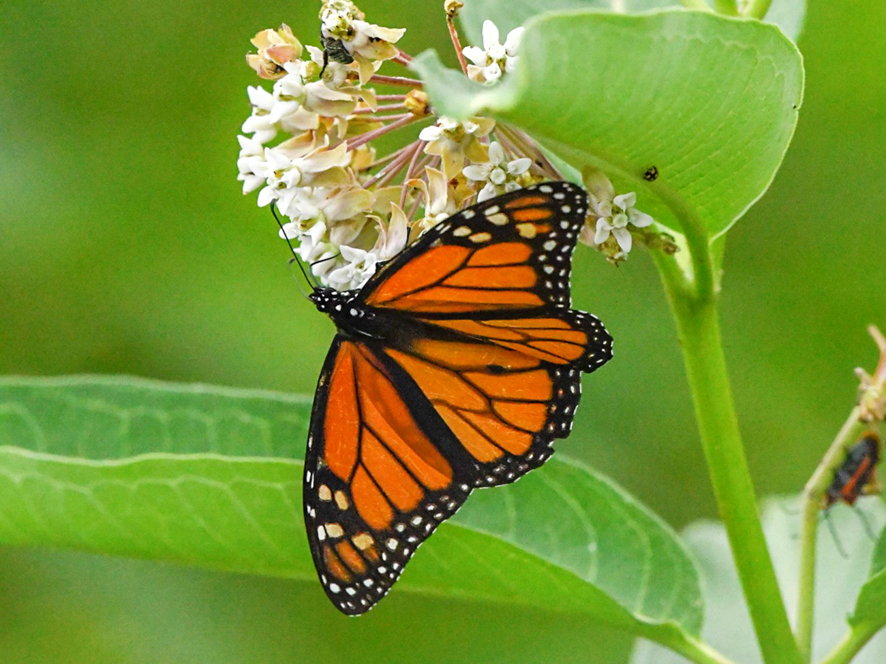
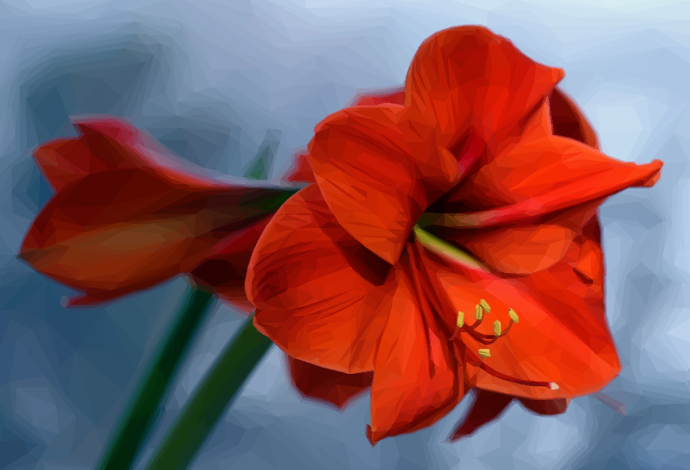
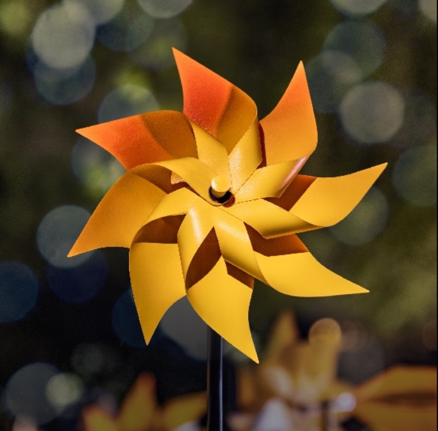
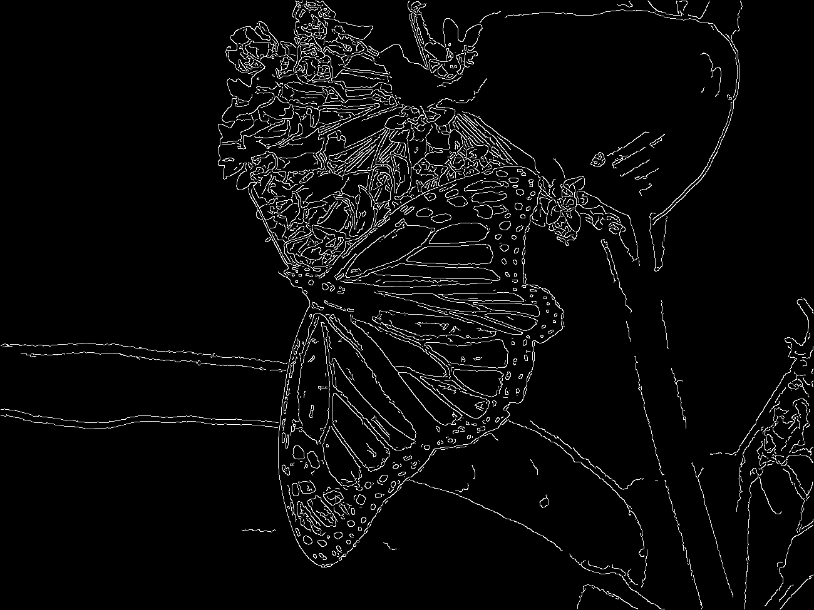
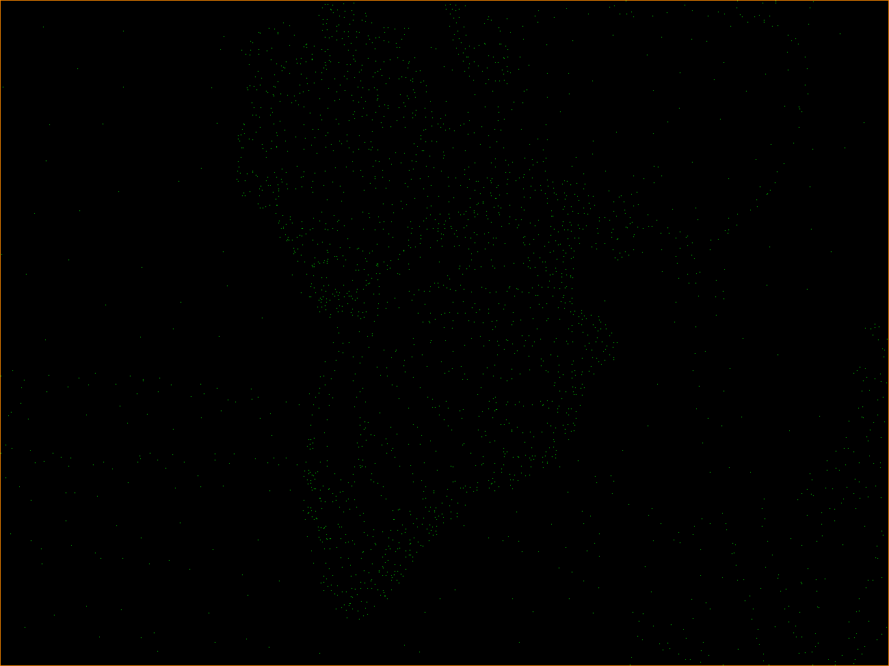
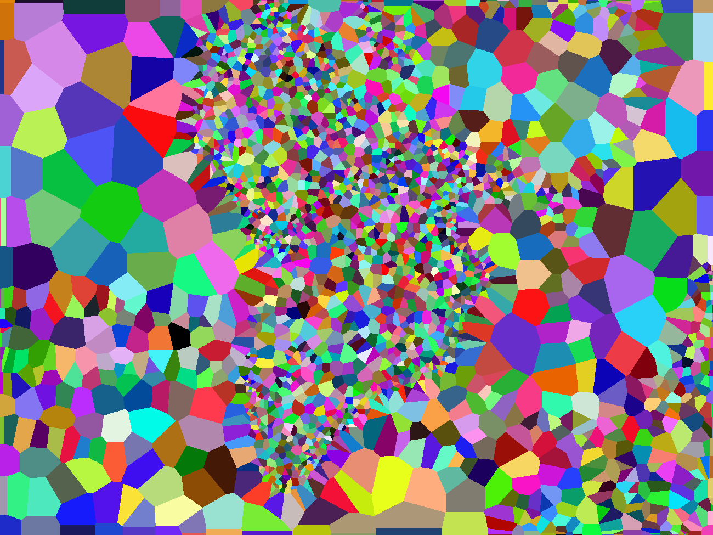
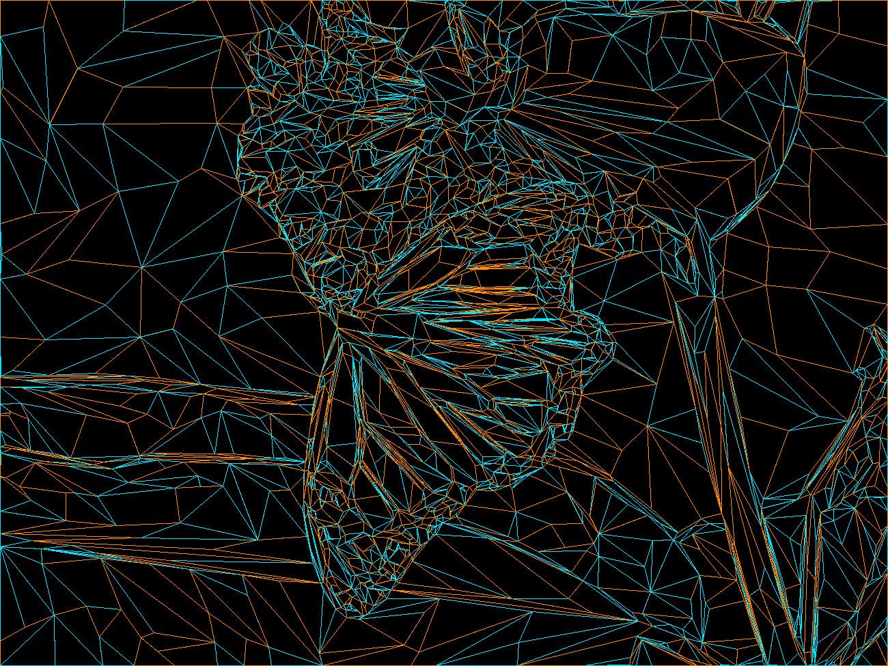
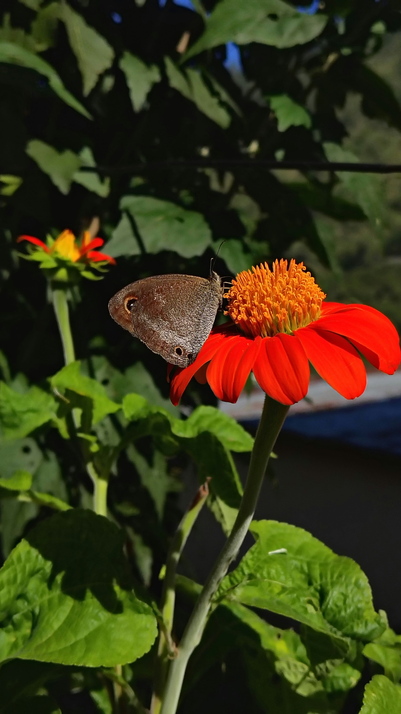

# lowpoly-cpp

Turns a photo into a low-poly image, keeping as much detail as it can with as
few polygons as it can.

| | |
|---|---|
|  |  |
|  |  |
|  |  |

This is a rewrite of an old class project (`fileMaker.cpp` and `driver.c`).
It is C++17 with two vendored stb headers, and runs on macOS, Linux and
Windows. There is an optional Metal backend on macOS and CUDA backend on
Linux and Windows.

```
lowpoly.h     types, stage signatures, the Gpu interface
lowpoly.cpp   cpu pipeline, cli, png writer, stage dumps, bench, tests
metal.mm      Metal kernels (compiled at startup) and ImageIO decode/encode
cuda.cu       the same kernels for CUDA
```

## 1. What it does

```sh
make                # macOS, cpu and Metal
make GPU=0          # cpu only, any platform
make CUDA=1         # Linux or Windows with nvcc
make test

cmake -B build && cmake --build build --config Release   # Visual Studio, or anywhere

./lowpoly photo.jpg                                  # photo-lowpoly.png
./lowpoly photo.jpg --points 2500                    # fewer, bigger polygons
./lowpoly photo.heic -o out.png -o out.svg           # raster and vector
./lowpoly photo.jpg --scale 3 --aa 3 -o print.png    # 3x size, antialiased
./lowpoly photo.jpg --stages out                     # also the stage images
```

Input is anything stb_image reads, and on macOS anything ImageIO reads (heic,
webp, tiff, avif). Phone photos are turned upright. Output is png, jpg, bmp,
tga, ppm or svg, plus heic and tiff on macOS. Paths can be any Unicode.

## 2. How it works

Shown on `examples/monarch.jpg` at 2500 points.

**Edges.** Canny edge detection, all in integer math.



**Points.** 5% of the points are scattered by edge density. The other 95% are
added in rounds. Each round builds the mesh, finds the polygons whose flat
colour is furthest from the photo, and splits them at the centre of their
worst pixels. The four corners are always points, and every point whose cell
touches a side gets a point on that side.



**Voronoi.** Every pixel is labelled with its nearest point. The search runs
per 8x8 tile over a short list of candidates, with SIMD.



**Mesh.** Where three cells meet, their points form a triangle (blue), and
where four meet, a quad (orange). This is the Delaunay triangulation. Missing
triangles along the border and overlaps between near-cocircular points are
fixed exactly, so the mesh always covers the image with no gaps or overlaps.

Then the mesh is reshaped to fit the photo.

- An edge between two triangles is flipped to the other diagonal when that
  lowers the colour error.
- Each point is nudged a pixel or two when that lowers the error of the
  polygons around it.
- Neighbouring triangles with close colours are joined into one quad.



**Final.** Each polygon is filled with the mean colour of its pixels. Every
pixel belongs to exactly one polygon.


## 3. Options

```
lowpoly <input> [options]
  -o FILE            output, repeatable. png jpg bmp tga ppm svg, heic tiff on macos
                     (default <input>-lowpoly.png)
  --scale F          output size multiplier, 0.01 to 100 (1)
  --aa N             supersample N x N then average down, 1 to 8 (1)
  --points N         interior sample points (10000)
  --levels N         grid levels for density weighting (150)
  --uniform F        fraction of points spread uniformly (0.08)
  --refine F         fraction of points placed by error refinement (0.95)
  --flip MODE        on | off, flip edges to lower the colour error (on)
  --relax N          rounds of nudging points to lower the colour error (2)
  --merge F          join close-coloured triangles into quads, 0 keeps them all (1)
  --seed N           rng seed (24301)
  --canny-low F      canny low threshold (5)
  --canny-high F     canny high threshold (25)
  --auto-canny       thresholds from the gradient distribution
  --color MODE       mean | corner (mean)
  --voronoi MODE     grid | jfa | brute (grid)
  --canny MODE       int | float (int)
  --extract MODE     hash | sort (hash)
  --raster MODE      bbox | owner (bbox)
  --backend MODE     auto | cpu | gpu (auto)
  --threads N        worker threads (all cores)
  --stages DIR       also write the six stage images to DIR
  --hull             overlay the seed hull on the output
  --text FILE        also write the Tri/Qua shape list
  --bench            time each stage against its alternatives
  -q                 quiet
```

`--relax 0` is about twice as fast for about 2 dB less detail.
`--refine 0 --flip off --relax 0 --merge 0` is the plain pipeline.

## 4. Results

PSNR against the photo (higher keeps more detail), polygon count, and
pipeline time on an M5 Pro. The README images use `--points 2500 --uniform
0.02 --canny-low 20 --canny-high 60`, and 40/120 for the butterfly.

| image | points | plain pipeline | default |
|---|---|---|---|
| canny-flower 717x706 | 2500 | 23.7 dB, 4,767 polys, 4 ms | 35.6 dB, 3,682 polys, 37 ms |
| | 10000 | 28.7 dB, 18,398 polys, 6 ms | 39.2 dB, 14,611 polys, 66 ms |
| flower 1024x699 | 2500 | 22.8 dB, 4,812 polys, 5 ms | 34.3 dB, 3,506 polys, 42 ms |
| | 10000 | 27.8 dB, 18,619 polys, 7 ms | 37.8 dB, 13,855 polys, 74 ms |
| monarch 1300x975 | 2500 | 20.2 dB, 4,911 polys, 7 ms | 27.8 dB, 3,442 polys, 47 ms |
| | 10000 | 23.5 dB, 19,226 polys, 8 ms | 32.0 dB, 13,943 polys, 84 ms |
| moto-butterfly 1600x2844 | 2500 | 19.8 dB, 4,954 polys, 15 ms | 27.9 dB, 3,407 polys, 92 ms |
| | 10000 | 22.2 dB, 19,362 polys, 17 ms | 31.6 dB, 13,794 polys, 150 ms |

The default at 2500 points keeps more detail than the plain pipeline at 10000
points, with about a fifth of the polygons.

The GPU backends are checked against the CPU bit for bit in `make test`, but
`--backend auto` stays on the CPU, which is faster end to end.

### Examples

Source on the left, output on the right. All stage images are in
`docs/img/<name>/`. Regenerate them with `make readme-images`.

| | |
|---|---|
| `canny-flower.jpg` (projectpro.io Canny recipe) | |
|  |  |
| `flower.jpg` (Connelly Barnes, intro vision proj1) | |
|  |  |
| `monarch.jpg` (NPS, Jamie Ratchford) | |
|  |  |
| `moto-butterfly.jpg` (Unsplash, Motorola Edge 50 Fusion sample) | |
|  |  |
